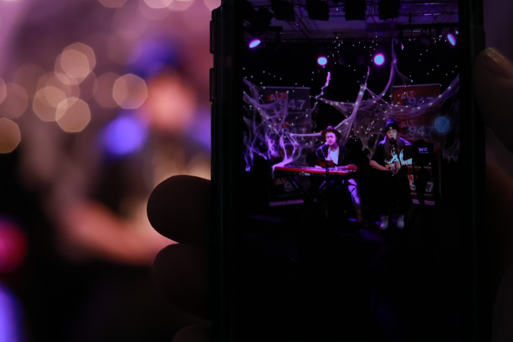

+++
    #this is the "front matter" of the template of a project. It's the variables associated with the file
    #this portion is written in TOML (Tom's Obvious Minimal Language)
    
    title = "Billie Eilish Soundstage"
    #replace takes the filename and replaces all hyphens with spaces so that when it appears on your page, it's using spaces. The filename is used in the URL and URLs can't have spaces so use hyphen in the filename.
    #title converts to title-case (using capital letters for principal words only)
    
    date = 2019-06-03T14:38:43-07:00 #the date the file was created

    
    shortDescription = "Performance by Billie Eilish for ALT94.7"
    projectVideo = ""
    #Project video is just the unique part of the URL  
    # For example, if the link is https://vimeo.com/285189099 then the unique part is  285189099
    projectVideoType = ""
    #Enter "youtube" or "vimeo". You can add other video types as well by editing single.html 
    projectImage = "billie6.jpg"
    #Enter the filename only. For example, "metropolis_album.jpg" 
    #This image should be saved in the project folder with the name of your project 
    projectImageAltText = ""
    #Alt text is the text that gets read by screenreaders for accessibility (typically for the visually impaired) 

+++

    

    

      
    

    

      
    

    

      
    

    

      
    

    

      
    

     

      
    

 

 <h3>About:</h3>

Billie Eilish performed for Alt 94.7 at Entercom Sacramento on October 21, 2018. Billie performed four songs during her soundstage, “COPYCAT,” “when the party is over,” “ocean eyes,” and “you should see me in a crown.” During the soundstage, I captured performance shots of her singing and meet and greet photos with her and the listeners. 

